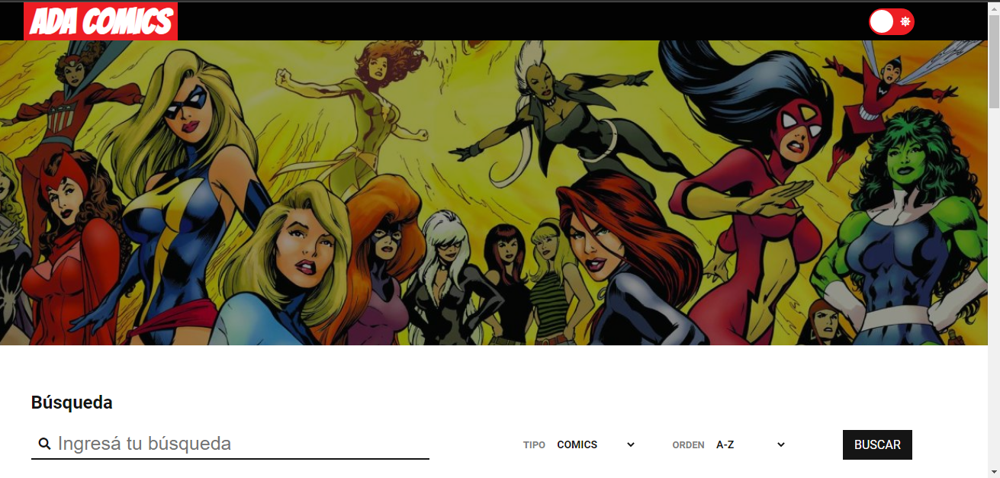

# ¡COMICS MARVEL!

Proyecto realizado en <a href="https://adaitw.org/">ADA ITW</a> 👩‍💻, aplicando API REST con datos reales.-
### 🛠️ Este proyecto cuenta con las siguientes funcionalidades 

- Se puede realizar una búsqueda de cómics.
- Se puede realizar una búsqueda por personaje.
- Se pueden ordenar los resultados alfabéticamente y por fecha de lanzamiento, en orden ascendente y descendente.
- Se muestra la información de un cómic (al clickear sobre el mismo): Portada, Título, Fecha de lanzamiento, Guionistas, Descripción, Personajes incluidos.
- Se muestra la información de un personaje (al clickear sobre el mismo): Imagen, Nombre, Descripción, Cómics en los que aparece.
- Se muestra el total de resultados en los casos en los que se listen cómics o personajes
- El proyecto cuenta con un paginado
- Se muestran 20 resultados por página
- Se puede ir a la primera página
- Se puede ir a la última página
- Se puede ir a la página siguiente
- Se puede ir a la página anterior
- Se deshabilitan los botones correspondientes cuando no puedan ser utilizados (por ejemplo, si se está en la última página, no se debe poder utilizar el botón de ir a la última página ni el de avanzar página)

Para ver el proyecto <a href="</a>
ó en 

### Tecnologias aplicadas:

- HTML5
- CSS3
- JavaScript
- MARVEL API Rest
- Se debe utilizar Live Server 
